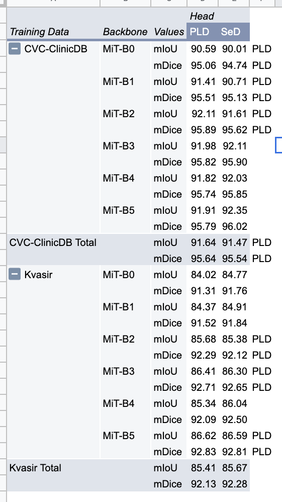

# [Reproduction Study of Stepwise Feature Fusion: Local Guides Global ](https://arxiv.org/abs/2203.03635v1)
Jinfeng Wang, Qiming Huang, Feilong Tang, Jia Meng, Jionglong Su, Sifan Song

[Code Repository for Paper](https://github.com/Qiming-Huang/scformer)

Thanks to sithu21296 for their [semantic segmentation framework](https://github.com/sithu31296/semantic-segmentation).

Best efforts were made to provide a fair reproduction for the results of the above paper.

[The full reproduction paper is here.](CS598DL4H_SP22_Rahul_Singhal_rahuls11_team_151.pdf)

All instructions are inline in the inlcluded [notebook.](https://github.com/RahulSinghalChicago/Reprod_scformer/blob/master/notebooks/Reproduction_SFF.ipynb)

### Dependencies:
Google Drive Account (can modify notebook for alternative filesystem)

Google Colab Pro+ (can utilize any GPU environment with at least 16GB of RAM)

Pretrained Weights download instruction:

    ckpt = Path('./checkpoints/backbones/mit')
    ckpt.mkdir(exist_ok=True, parents=True)
    %cd checkpoints/backbones/mit
    #B0
    !gdown 1EyaZVdbezIJsj8LviM7GaIBto46a1N-Z
    #B1
    !gdown 1L8NYh3LOSGf7xNm7TsZVXURbYYfeJVKh
    #B2
    !gdown 1m8fsG812o6KotF1NVo0YuiSfSn18TAOA
    #B3
    !gdown 1d3wU8KNjPL4EqMCIEO_rO-O3-REpG82T
    #B4
    !gdown 1BUtU42moYrOFbsMCE-LTTkUE-mrWnfG2
    #B5
    !gdown 1d7I50jVjtCddnhpf-lqj8-f13UyCzoW1
    %cd ../../..

    ckpt = Path('./checkpoints/backbones/pvtv2')
    ckpt.mkdir(exist_ok=True, parents=True)
    %cd checkpoints/backbones/pvtv2
    #B1
    !gdown 1LsG_OBji73Iay8fR-gBRKxHVA0GUsSoR
    #B2
    !gdown 1eDCLaB0G24H3IBRLlIfM4Xg7kBW8MBx_ 
    #B3
    !gdown 1VttlOsYpArGyiNDX9v3nVBnEwpgeJE-k
    #B4
    !gdown 1lvHYBBrj4zLkx1hnVJu2EGxBVCLWg3_j
    #B5
    !gdown 1xAVfI0rnZAFsQA357r9ZavhpwktGV6AW
    %cd ../../..

### Data download insructions:

    %cd /content/notebooks/semantic-segmentation/data
    !kaggle datasets download -d balraj98/cvcclinicdb
    !unzip -d CVC-ClinicDB -q cvcclinicdb.zip
    !rm cvcclinicdb.zip
    !mv CVC-ClinicDB/PNG/Original CVC-ClinicDB/images
    !mv 'CVC-ClinicDB/PNG/Ground Truth' CVC-ClinicDB/masks
    !rm -rf CVC-ClinicDB/PNG
    !rm -rf CVC-ClinicDB/TIF

    !wget -q https://datasets.simula.no/downloads/kvasir-seg.zip
    !unzip -d Kvasir-SEG kvasir-seg.zip
    !rm kvasir-seg.zip

### Preprocessing code + command

    seed = 1337
    ratio = (.8,.1,.1)
    !pip install split-folders
    import splitfolders
    
    splitfolders.ratio('Kvasir-SEG', output="Kvasir-SEG", seed=seed, ratio=ratio)
    
    splitfolders.ratio('CVC-ClinicDB', output="CVC-ClinicDB", seed=seed, ratio=ratio)
    !rm -rf CVC-ClinicDB/images CVC-ClinicDB/masks

### Training code + command

  dataset_name = 'kvasir-seg'
  config_file = dataset_name + '.yaml'
  NOHUP_FILE = 'output/logs_txt/' + dataset_name + '.log'
  %cd /content/notebooks/semantic-segmentation/

  !echo $NOHUP_FILE
  !nohup python -u tools/train.py --cfg configs/$config_file > $NOHUP_FILE 2>&1 &
  
  !tail -f $NOHUP_FILE

### Evaluation code + command

  %cd /content/notebooks/semantic-segmentation/
  !python -u tools/val.py --cfg configs/$config_file

### Pretrained model (if applicable)

  [Kvasir Weights](https://drive.google.com/drive/folders/1-0iBmX13qZiqLNugyaTn3tZE88vd-16O?usp=sharing)

  [CVC-ClinicDB Weights](https://drive.google.com/drive/folders/1n5x6Rz8xT_N1iEgiKj5nqpPvmdyzI8Ya?usp=sharing)
  
### Table of results (no need to include additional experiments, but main reproducibility result should be included)

  
  

